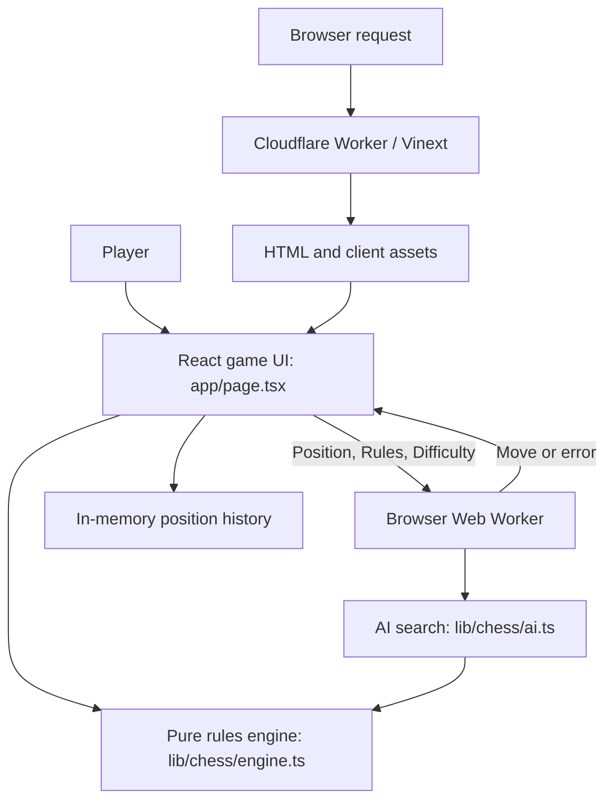

# Chess Sandbox architecture

This document describes the implemented system. Update it in the same commit as changes to module boundaries, game state, rules, AI behavior, dependencies, hosting, or storage. Keep proposed features clearly separate from shipped behavior.

## Product and design constraints

Chess Sandbox is a single-page chess game against a local AI, with customizable rules. Both human move validation and AI search must use the same engine and active rule configuration. Game execution requires no remote inference service, API key, or paid AI calls.

The current product has no multiplayer service, clocks, board editor, database-backed games, or browser persistence. Reloading starts a fresh game. The main route is `/`.

## System boundaries

The Cloudflare Worker serves the application; it does not play the game. The browser Web Worker is a separate runtime used for CPU-heavy AI search.

## Module map

| Module | Responsibility |
| --- | --- |
| `app/page.tsx` | Board, setup controls, turn lifecycle, promotion dialogs, history, undo, resignation, and optional WebMCP state reads |
| `app/layout.tsx` | Document metadata and product icon references |
| `app/globals.css` | Shared theme, board rendering, responsive layout, and branding |
| `lib/chess/engine.ts` | Types, presets, positions, attacks, move generation, move application, outcomes, repetition keys, notation |
| `lib/chess/ai.ts` | Evaluation and time-bounded iterative-deepening negamax search |
| `lib/chess/ai.worker.ts` | Browser worker message adapter for search |
| `components/ui/` | Vendored accessible UI primitives, composed by the game screen |
| `tests/engine.test.ts` | Engine correctness checks, special moves, and variant semantics |
| `vite.config.ts` | Vinext, Cloudflare, and retained hosting/preview plugins |
| `build/sites-worker.ts` | Server fetch entry point delegating to Vinext |
| `scripts/run-framework.mjs` | Selects framework execution using the local execution profile |
| `public/chess-sandbox-icon.png` | Canonical product icon, used in the header and document metadata |

## Position and rule model

`Position.board` is a 64-element array of pieces or null, indexed from a8 (0) to h1 (63). A piece stores color (`w` or `b`) and kind (`p`, `n`, `b`, `r`, `q`, `k`). The position also stores side to move, castling rights, en passant target, halfmove counter, and ply count.

`Move` contains source and destination indexes, with optional promotion kind, en passant victim index, and rook relocation for castling. `applyMove` returns a new position and board array. Callers must supply a legal move; move application itself is not a validation boundary.

`Rules` contains nine options: victory condition, forced captures, castling, en passant, pawn double step, backward pawn captures, super knights, promotion policy, and random starting position. Presets are Classic, King of the Hill, Giveaway, and Wild Knights.

The engine generates pseudo-legal moves, filters king exposure for royal variants, then enforces mandatory captures. Giveaway always requires available captures, disables castling, and treats kings as ordinary pieces. Capture-the-king ignores check. Hill wins by reaching d4/e4/d5/e5 with a king or by checkmate. Super knights retain knight jumps and gain adjacent steps; backward pawn captures do not permit backward non-capturing moves.

## State and move lifecycle

1. Setup edits update `draft` rules and `draftHuman`. Active `rules` and `human` remain unchanged until a new game starts. Difficulty changes apply immediately.
2. Selecting a human piece reveals destinations from `legalMoves`. A destination with multiple promotion moves opens a choice dialog.
3. `commitMove` applies the move, computes notation, appends a snapshot, and clears selection.
4. The UI checks terminal engine outcomes, resignation, and threefold repetition across its stored history.
5. On an AI turn, an effect creates a browser worker and sends `{ position, rules, difficulty }`. It returns `{ move }` or `{ error }`.
6. The effect terminates the worker on cleanup. New game, undo, resignation, and difficulty changes cancel obsolete search. Errors show a retry action.

History is the source of truth for the current position. Undo removes the human move and its AI reply, or only the pending human move if the AI has not replied. A new game resets history and selects the board orientation from the chosen human color. Board flipping is presentation-only.

## AI behavior and limits

The AI uses iterative-deepening negamax, alpha-beta pruning, capture/promotion move ordering, and variant-aware material/position evaluation. The last completed search iteration supplies the move when the time budget expires.

| Difficulty | Maximum depth | Search budget | Behavior |
| --- | --- | --- | --- |
| Easy | 1 ply | 120 ms | 35% random-move chance, otherwise noisy evaluation |
| Medium | 3 plies | 500 ms | Deterministic evaluation |
| Hard | 5 plies | 1600 ms | Deeper deterministic search |

Budgets are cooperative checks, not hard real-time guarantees. A 300 ms UI delay precedes search. Strength depends on device speed and variant branching factor; levels are not calibrated Elo ratings. Search has no repetition-history evaluation, transposition table, opening book, or quiescence search.

Threefold repetition and the 50-move rule are automatically adjudicated. Insufficient-material detection covers a useful subset of classic positions, not every FIDE dead position. Avoid claiming full tournament rules compliance.

## Browser interfaces and accessibility

The board supports click/tap selection, arrow-key focus movement, and Escape to clear selection. Squares expose coordinates and piece names; turn status is announced through a live region. Radix/Shadcn supplies dialogs, switches, selectors, and radios.

When supported, the page registers `read_chess_game` through WebMCP. This read-only tool accepts only an empty object and returns the current board, rules, status, and engine-generated legal moves. Unsupported browsers proceed normally. Registration is cleaned up with an abort signal.

## Build and hosting

Use Node.js 22.13+ and the committed npm lockfile. `npm ci` installs the reproducible dependency graph. Keep Wrangler and `@cloudflare/workers-types` peer requirements compatible; change their package declarations and lockfile together.

`npm run build` produces a Cloudflare-compatible server entry in `dist/server/index.js`, generated Wrangler configuration in `dist/server/wrangler.json`, and browser assets in `dist/client`. Direct Cloudflare deployments should use the generated configuration. Do not hand-edit generated output.

The repository retains the original hosting adapter and connector scaffolding. The chess route does not invoke external connectors or require D1/R2. `.openai/hosting.json` identifies the original hosting integration; it is not a GitHub repository setting. Local execution profile data under `.sites-runtime/` is ignored, and clean clones default to the portable profile.

## Verification and maintenance

Run `npm run typecheck`, `npm test`, and `npm run build` for changes affecting engine, worker, or application behavior. The engine suite checks opening perft counts 20/400/8902, checkmate, castling restrictions, en passant, promotions, pinned pieces, and custom variants. For dependency changes also verify `npm ci`.

For UI or worker changes, verify a human move plus AI reply, undo, rule activation, and narrow-screen layout in the browser. For rule changes, add a focused position test and verify both human and AI use the rule. For branding changes, check visible header, metadata, icon, package metadata, and README.

Keep this document about the shipped architecture. Update README links and relevant limitations when capabilities change. Do not commit generated build output, TypeScript caches, local credentials, or environment files.

## Randomized starting positions

`initialPosition(rules, random)` accepts the active rules and an injectable random source for reproducible tests. `randomStart` supports three options:

- `off`: Standard initial chess layout and castling rights.
- `except-pawns`: Fisher–Yates shuffles the eight back-rank pieces once and mirrors the order for both colors. Pawns stay on their usual ranks, shielding kings. A classic-order result swaps two pieces so the opening visibly differs.
- `all`: Shuffles all 16 pieces and pawns across each player's home ranks (ranks 1–2 for White, ranks 7–8 for Black), mirrored rank-symmetrically. Redraws if either king would start under check.

With any randomized start active (`except-pawns` or `all`), castling rights are empty throughout the game regardless of the stored castling preference, and the setup UI disables the castling switch.

Randomness runs only when starting a game, never during rendering or AI search. History retains the generated position so undo restores that same opening. Each new game samples a fresh arrangement; repeats are possible. Standard initial positions and preset defaults are unchanged.
